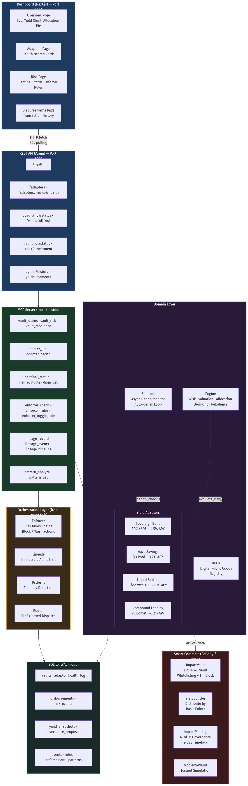
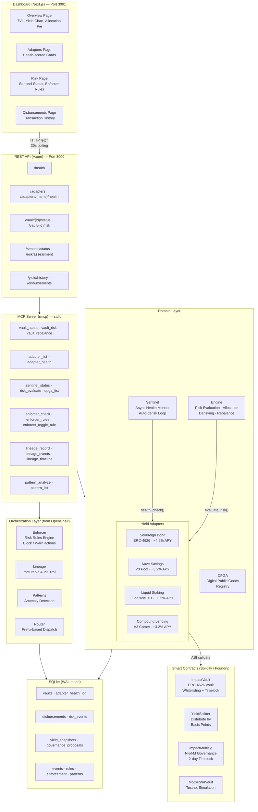

# ImpactVault

Open-source risk-curated yield infrastructure for social impact organisations.

ImpactVault deploys and manages risk-curated yield vaults configured as sustainable funding engines for social impact programmes. Donors or organisations deposit crypto assets. The engine generates yield across a configurable risk spectrum (from tokenised government bonds to diversified DeFi lending). Yield gets automatically streamed to designated impact recipients — including Digital Public Goods. Principal stays untouched.

## Built with OpenCheir

ImpactVault is built on top of [OpenCheir](https://github.com/fabio-rovai/opencheir), an open-source MCP (Model Context Protocol) meta-server for orchestrating tools, policies, and agents.

**What OpenCheir provides:**

- **MCP Server framework** — the `rmcp` crate with stdio transport, `#[tool]` macros, and `ServerHandler` trait. ImpactVault's 19 MCP tools are exposed through this framework, making the entire vault controllable from Claude Code or any MCP-compatible client.
- **Enforcer** — a sliding-window rule engine (`MissingInWindow`, `RepeatWithout` conditions) that enforces risk policies. ImpactVault uses it for derisk-on-health-breach, oracle staleness warnings, and concentration limits.
- **Lineage** — immutable audit trail recording every vault operation (deposits, withdrawals, risk evaluations, derisk actions). Every event is traceable back to its session and causal chain.
- **Pattern discovery** — analyses enforcement logs to surface recurring risk patterns and behavioural anomalies.
- **State store** — SQLite with WAL mode, FTS5 full-text search, and a migration system. ImpactVault extends this with vault-specific tables (health logs, disbursements, yield snapshots, governance proposals).
- **Config system** — TOML-based hierarchical configuration with hot-reload via file watcher.
- **Tool router** — prefix-based routing that dispatches tool calls to the correct domain handler (`vault_*`, `adapter_*`, `sentinel_*`, `enforcer_*`, `lineage_*`, `pattern_*`, `dpga_*`, `risk_*`).

**How the fork works:**

ImpactVault started as a fork of OpenCheir's codebase. The generic MCP infrastructure (server, enforcer, lineage, patterns, state, config, router) was kept as-is. Domain-specific modules were added on top:

```text
OpenCheir (inherited)              ImpactVault (added)
─────────────────────              ───────────────────
gateway/server.rs (MCP framework)  domain/engine.rs (risk engine)
gateway/router.rs (tool routing)   domain/adapters/ (yield sources)
orchestration/enforcer.rs          domain/sentinel.rs (health monitor)
orchestration/lineage.rs           domain/dpga.rs (DPG registry)
orchestration/patterns.rs          gateway/api.rs (REST API)
store/state.rs (SQLite)            contracts/ (Solidity vaults)
config.rs (TOML + hot-reload)      dashboard/ (Next.js UI)
```

This means ImpactVault inherits upstream improvements to the MCP server, enforcer rule engine, and lineage system — while adding yield-specific business logic on top.

---

## Architecture

```text
impactvault/
├── src/
│   ├── main.rs                    CLI entrypoint (init, serve commands)
│   ├── lib.rs                     Library exports
│   ├── config.rs                  TOML config (vault, adapters, sentinel, governance, DPGA, dashboard)
│   ├── domain/
│   │   ├── engine.rs              Risk engine: types, evaluation, allocation, derisking, rebalance
│   │   ├── sentinel.rs            Async monitoring loop with auto-derisk
│   │   ├── dpga.rs                Digital Public Goods Alliance registry integration
│   │   └── adapters/
│   │       ├── mod.rs             YieldAdapter trait definition + TxRequest type
│   │       ├── sovereign_bond.rs  Tokenised government bonds (ERC-4626)
│   │       ├── aave_savings.rs    Aave V3 lending pool
│   │       ├── liquid_staking.rs  Lido wstETH liquid staking
│   │       └── compound_lending.rs Compound V3 (Comet) lending
│   ├── gateway/
│   │   ├── server.rs              MCP server with 19 tools
│   │   ├── router.rs              Prefix-based tool routing
│   │   ├── api.rs                 REST API (Axum, 9 endpoints)
│   │   └── proxy.rs               WebSocket proxy
│   ├── orchestration/
│   │   ├── enforcer.rs            Risk rule engine (block/warn actions)
│   │   ├── lineage.rs             Immutable audit trail
│   │   └── patterns.rs            Risk pattern discovery
│   └── store/
│       ├── state.rs               SQLite with WAL mode + FTS5
│       └── migrations/
│           ├── 001_initial.sql           Core tables (sessions, events, rules, patterns)
│           ├── 002_ontology_versions.sql Ontology versioning
│           ├── 003_domain_locks.sql      Distributed locks
│           ├── 004_vault_state.sql       Vaults, health logs, disbursements, risk events
│           └── 005_yield_history.sql     Yield snapshots, governance proposals
├── contracts/
│   ├── foundry.toml               Solidity build config
│   ├── src/
│   │   ├── ImpactVault.sol        ERC-4626 vault (whitelisting, timelock, emergency derisk)
│   │   ├── YieldSplitter.sol      Yield distribution by basis points
│   │   ├── ImpactMultisig.sol     N-of-M governance (2-day timelock, emergency bypass)
│   │   └── mocks/
│   │       └── MockRWAVault.sol   Testnet sovereign bond simulation
│   ├── script/
│   │   ├── DeployBase.s.sol       Base mainnet deployment (chain ID 8453)
│   │   └── DeploySepolia.s.sol    Sepolia testnet deployment
│   └── test/
│       ├── ImpactVault.t.sol      Vault tests (4 tests)
│       ├── YieldSplitter.t.sol    Splitter tests (4 tests)
│       ├── MockRWAVault.t.sol     Mock tests (3 tests)
│       ├── ImpactMultisig.t.sol   Governance tests (10 tests)
│       └── Integration.t.sol      End-to-end deposit-yield-distribute (4 tests)
├── dashboard/
│   ├── src/
│   │   ├── app/
│   │   │   ├── layout.tsx         Dark theme with sidebar navigation
│   │   │   ├── page.tsx           Overview (TVL, yield chart, allocation pie)
│   │   │   ├── adapters/page.tsx  Adapter health cards
│   │   │   ├── risk/page.tsx      Health gauge, sentinel status, enforcer rules
│   │   │   └── disbursements/page.tsx  Disbursement history table
│   │   ├── components/
│   │   │   ├── MetricCard.tsx     Key metric display
│   │   │   ├── HealthGauge.tsx    Color-coded health score (green/amber/red)
│   │   │   ├── AllocationPie.tsx  Recharts donut chart
│   │   │   ├── YieldChart.tsx     Recharts line chart
│   │   │   ├── AdapterCard.tsx    Adapter info card with health
│   │   │   ├── SentinelStatus.tsx Sentinel monitoring status
│   │   │   └── DisbursementTable.tsx Transaction history table
│   │   └── lib/
│   │       └── api.ts             Typed fetch wrapper for REST API
│   └── package.json               Next.js 15 + Tailwind + Recharts
├── adapter-template/              Scaffold for community adapters
├── tests/                         139 Rust integration tests across 18 test files
└── docs/
    ├── plans/                     Design documents and implementation plans
    └── mockups/                   Dashboard mockup screenshots
```

---

## Prerequisites

| Tool    | Version | Purpose                                 |
|---------|---------|---------------------------------------- |
| Rust    | 1.80+   | Backend, MCP server, risk engine        |
| Foundry | latest  | Solidity contracts (forge, cast, anvil)  |
| Node.js | 18+     | Dashboard (Next.js)                     |
| npm     | 9+      | Dashboard dependencies                  |

### Install Rust

```bash
curl --proto '=https' --tlsv1.2 -sSf https://sh.rustup.rs | sh
```

### Install Foundry

```bash
curl -L https://foundry.paradigm.xyz | bash
foundryup
```

### Install Node.js

```bash
# macOS with Homebrew
brew install node

# Or use nvm
nvm install 18
```

---

## Quick Start

```bash
# 1. Clone
git clone https://github.com/fabio-rovai/impactvault.git
cd impactvault

# 2. Build everything
cargo build --release
cd contracts && forge build && cd ..
cd dashboard && npm install && cd ..

# 3. Run tests
cargo test                              # 139 Rust tests
cd contracts && forge test && cd ..     # 25 Solidity tests
cd dashboard && npx next build && cd .. # Dashboard build check

# 4. Initialize
./target/release/impactvault init

# 5. Start MCP server
./target/release/impactvault serve

# 6. (Separate terminal) Start REST API — served by the MCP server process

# 7. (Separate terminal) Start dashboard
cd dashboard && npm run dev
# Open http://localhost:3001
```

---

## Running Each Component

### MCP Server

The MCP server is the core process. It exposes 19 tools via stdio transport for Claude Code or any MCP client.

```bash
# Initialize data directory and SQLite database
./target/release/impactvault init --data-dir ~/.impactvault

# Start the server
./target/release/impactvault serve --config ~/.impactvault/config.toml
```

The server:
- Loads config from `~/.impactvault/config.toml`
- Opens SQLite database at `~/.impactvault/impactvault.db`
- Seeds built-in enforcer rules (derisk-on-health-breach, oracle staleness, concentration limit)
- Watches config file for changes and hot-reloads enforcer rules
- Serves MCP tools over stdio

#### Using with Claude Code

Add to your Claude Code MCP config:

```json
{
  "mcpServers": {
    "impactvault": {
      "command": "/path/to/impactvault",
      "args": ["serve"]
    }
  }
}
```

Then use tools like `vault_status`, `adapter_list`, `sentinel_status`, `risk_evaluate`, `dpga_list`, `vault_rebalance`, etc.

### REST API

The REST API runs on port 3000 (configurable) and serves data for the dashboard.

```bash
# The API is started as part of the serve command
# Configure the port in config.toml:
# [api]
# port = 3000
```

**Endpoints:**

| Method | Path | Description |
|--------|------|-------------|
| GET | `/health` | Health check (`{"status": "ok"}`) |
| GET | `/adapters` | List all yield adapters |
| GET | `/adapters/{name}/health` | Individual adapter health |
| GET | `/vault/{id}/status` | Vault portfolio status |
| GET | `/vault/{id}/risk` | Vault risk assessment |
| GET | `/sentinel/status` | Sentinel monitoring status |
| GET | `/yield/history` | Historical yield snapshots |
| GET | `/disbursements` | Disbursement transaction log |
| GET | `/risk/assessment` | Full risk evaluation |

### Dashboard

Next.js app on port 3001. Requires the REST API to be running on port 3000.

```bash
cd dashboard

# Install dependencies
npm install

# Development (hot-reload)
npm run dev
# Open http://localhost:3001

# Production build
npm run build
npm run start
```

**Pages:**
- **Overview** (`/`) — TVL, total yield, disbursed amounts, allocation pie chart, yield-over-time chart
- **Adapters** (`/adapters`) — Health-scored cards per adapter with APY and TVL
- **Risk** (`/risk`) — Overall health gauge, sentinel status, active alerts, enforcer rules table
- **Disbursements** (`/disbursements`) — Summary metrics + sortable transaction history

**Environment variables:**

```bash
# Override API URL (default: http://localhost:3000)
NEXT_PUBLIC_API_URL=http://your-api-host:3000 npm run dev
```

### Smart Contracts

#### Run Tests

```bash
cd contracts
forge test -vvv    # verbose output
forge test --gas-report   # with gas estimates
```

#### Deploy to Sepolia (testnet)

```bash
cd contracts

# Set environment variables
export PRIVATE_KEY="your-deployer-private-key"
export SEPOLIA_RPC_URL="https://eth-sepolia.g.alchemy.com/v2/YOUR_KEY"

# Deploy
forge script script/DeploySepolia.s.sol --rpc-url $SEPOLIA_RPC_URL --broadcast

# Verify on Etherscan
forge verify-contract <address> src/ImpactVault.sol:ImpactVault --chain sepolia
```

#### Deploy to Base (mainnet)

```bash
cd contracts

export PRIVATE_KEY="your-deployer-private-key"
export BASE_RPC_URL="https://mainnet.base.org"
export SIGNER_1="0x..."  # Multisig signer 1
export SIGNER_2="0x..."  # Multisig signer 2
export SIGNER_3="0x..."  # Multisig signer 3

forge script script/DeployBase.s.sol --rpc-url $BASE_RPC_URL --broadcast
```

This deploys:
1. **ImpactVault** — ERC-4626 vault with USDC as underlying asset
2. **YieldSplitter** — yield distribution to impact recipients
3. **ImpactMultisig** — 2-of-3 governance with 2-day timelock
4. Transfers vault ownership to the multisig

---

## Configuration

ImpactVault uses a TOML config file at `~/.impactvault/config.toml`. Changes are hot-reloaded.

```toml
[general]
data_dir = "~/.impactvault"

# ── Vault Settings ────────────────────────────────────────────
[vault]
approved_sources = ["Sovereign", "StablecoinSavings", "LiquidStaking", "DiversifiedLending"]
concentration_limit = 80           # max % in any single adapter
derisking_health_threshold = 0.5   # auto-derisk below this score

# ── Yield Adapters ────────────────────────────────────────────
[[adapters]]
name = "sovereign_bond"
type = "sovereign_bond"
contract_address = "0x..."         # ERC-4626 vault address
chain_id = 11155111                # Sepolia
rpc_url = "https://eth-sepolia.g.alchemy.com/v2/KEY"

[[adapters]]
name = "aave_savings"
type = "aave_savings"
pool_address = "0x..."             # Aave V3 Pool
asset_address = "0x..."            # USDC address
chain_id = 11155111
rpc_url = "https://eth-sepolia.g.alchemy.com/v2/KEY"

[[adapters]]
name = "liquid_staking"
type = "liquid_staking"
wsteth_address = "0x..."           # Lido wstETH contract
chain_id = 8453                    # Base
rpc_url = "https://mainnet.base.org"

[[adapters]]
name = "compound_lending"
type = "compound_lending"
comet_address = "0x..."            # Compound V3 Comet
asset_address = "0x..."            # USDC address
chain_id = 8453
rpc_url = "https://mainnet.base.org"

# ── Sentinel Monitoring ──────────────────────────────────────
[sentinel]
poll_interval_secs = 60
auto_derisk_enabled = true

# ── Enforcer Rules ───────────────────────────────────────────
[enforcer]
enabled = true
default_action = "block"

# ── Governance ───────────────────────────────────────────────
[governance]
type = "multisig"
contract_address = "0x..."
threshold = 2
signers = ["0xsigner1", "0xsigner2", "0xsigner3"]

# ── DPGA Integration ─────────────────────────────────────────
[dpga]
api_url = "https://api.digitalpublicgoods.net/dpgs"
enabled = true

# ── API ──────────────────────────────────────────────────────
[api]
port = 3000

# ── Dashboard ────────────────────────────────────────────────
[dashboard]
api_url = "http://localhost:3000"
```

---

## Core Concepts

### Risk Spectrum

Yield sources are ordered by risk, lowest to highest:

| Position | Adapter | Typical APY | Risk Profile |
|----------|---------|-------------|--------------|
| Sovereign | Sovereign Bond | ~4.5% | Tokenised government bonds — lowest risk |
| StablecoinSavings | Aave Savings | ~3.2% | Established lending protocol |
| LiquidStaking | Liquid Staking (Lido) | ~3.5% | ETH proof-of-stake rewards |
| DiversifiedLending | Compound Lending | ~3.2% | Diversified lending market |
| MultiStrategy | (future) | blended | Multi-source blended allocation |

### Weighted Allocation

Configure how capital is distributed across approved sources:

```toml
[vault]
approved_sources = ["Sovereign", "StablecoinSavings", "LiquidStaking"]
# source_weights: Sovereign=40%, StablecoinSavings=35%, LiquidStaking=25%
```

The engine allocates by weight, capped at `concentration_limit`. If weights aren't configured, it falls back to equal split. Rebalancing is recommended when any allocation drifts beyond a configurable threshold from its target weight.

### Sentinel Monitoring

The sentinel runs an async polling loop that:
1. Calls `health_check()` on every active adapter
2. Scores each adapter (0.0-1.0) based on oracle freshness, liquidity, utilisation
3. Feeds scores into `should_derisk()` which decides: **Hold**, **Migrate**, or **EmergencyWithdraw**
4. If `auto_derisk_enabled`, executes the derisk action automatically

Health score thresholds:
- **> 0.8** (green) — healthy, hold position
- **0.5 - 0.8** (amber) — degraded, monitor closely
- **0.2 - 0.5** (red) — unhealthy, migrate to safer source
- **< 0.2** (critical) — emergency withdraw all funds

### Enforcer Rules

Three built-in risk rules:

| Rule | Action | Trigger |
|------|--------|---------|
| `derisk_on_health_breach` | Block | Adapter health score drops below threshold |
| `oracle_staleness` | Warn | Price oracle hasn't updated within window |
| `concentration_limit` | Block | Single adapter exceeds concentration % |

Rules can be toggled via the `enforcer_toggle_rule` MCP tool or config hot-reload.

### Smart Contract Governance

The ImpactMultisig contract provides N-of-M signer governance:

- Any signer can **propose** an action (auto-approves)
- Other signers **approve** (no double-approvals)
- After threshold met + 2-day timelock: anyone can **execute**
- **Emergency derisk**: any single signer can trigger (bypasses threshold/timelock)

---

## Yield Adapters

### Built-in Adapters

| Adapter | Protocol | Deposit | Withdraw | Chain |
|---------|----------|---------|----------|-------|
| `sovereign_bond` | ERC-4626 vault | `deposit(assets, receiver)` | `withdraw(assets, receiver, owner)` | Sepolia / Base |
| `aave_savings` | Aave V3 Pool | `supply(asset, amount, onBehalfOf, referralCode)` | `withdraw(asset, amount, to)` | Sepolia / Base |
| `liquid_staking` | Lido wstETH | `wrap(stETHAmount)` | `unwrap(wstETHAmount)` | Base |
| `compound_lending` | Compound V3 Comet | `supply(asset, amount)` | `withdraw(asset, amount)` | Base |

### Creating a New Adapter

Use the template in `adapter-template/`:

```bash
cp -r adapter-template/ my-adapter/
cd my-adapter
# Edit src/lib.rs — implement the YieldAdapter trait
```

The `YieldAdapter` trait requires 7 methods:

```rust
#[async_trait]
pub trait YieldAdapter: Send + Sync {
    fn name(&self) -> &str;                                    // unique identifier
    fn risk_position(&self) -> RiskSpectrum;                   // where on risk spectrum
    async fn deposit(&self, amount: u128) -> Result<TxRequest>;  // generate deposit calldata
    async fn withdraw(&self, amount: u128) -> Result<TxRequest>; // generate withdraw calldata
    async fn current_yield_apy(&self) -> Result<f64>;          // current APY (%)
    async fn health_check(&self) -> Result<HealthStatus>;      // health score 0.0-1.0
    async fn tvl(&self) -> Result<u128>;                       // total value locked (wei)
}
```

Each adapter generates unsigned transaction calldata (ABI-encoded function selector + parameters). The actual signing and submission happens externally.

---

## MCP Tools

ImpactVault exposes 19 MCP tools, grouped by prefix:

**Vault tools:**
- `vault_status` — portfolio summary (TVL, adapters, risk level)
- `vault_risk` — risk assessment (market, contract, counterparty)
- `vault_rebalance` — check if portfolio needs rebalancing

**Adapter tools:**
- `adapter_list` — list all adapters with risk positions
- `adapter_health` — health score for a specific adapter

**Sentinel tools:**
- `sentinel_status` — monitoring status (running, checks, last action)

**Risk tools:**
- `risk_evaluate` — on-demand risk evaluation

**DPGA tools:**
- `dpga_list` — list Digital Public Goods eligible for yield disbursements

**Enforcer tools:**
- `enforcer_check` — check a tool call against risk rules
- `enforcer_log` — view enforcement history
- `enforcer_rules` — list all rules
- `enforcer_toggle_rule` — enable/disable a rule

**Lineage tools:**
- `lineage_record` — record an event
- `lineage_events` — query events by session/type
- `lineage_timeline` — session timeline

**Pattern tools:**
- `pattern_analyze` — discover risk patterns from enforcement logs
- `pattern_list` — list discovered patterns

---

## Database Schema

SQLite with WAL mode. 5 migration files, applied in order on init.

**Core tables** (from OpenCheir):
- `sessions` — session tracking
- `events` — lineage event log
- `rules` — enforcer rules (name, condition JSON, action, enabled)
- `enforcement` — enforcement action history
- `patterns` — discovered risk patterns

**Vault tables** (ImpactVault-specific):
- `vaults` — vault config and portfolio state (JSON)
- `adapter_health_log` — historical health scores per adapter
- `disbursements` — yield disbursement transactions (recipient, amount, tx_hash, block)
- `risk_events` — risk evaluation triggers and actions
- `yield_snapshots` — periodic APY + TVL snapshots per adapter
- `governance_proposals` — on-chain multisig proposal mirror

---

## Testing

```bash
# Run all Rust tests (139 tests across 18 test files)
cargo test

# Run specific test file
cargo test --test engine_test
cargo test --test sentinel_test
cargo test --test api_test

# Run specific test
cargo test test_full_pipeline_multi_strategy -- --nocapture

# Run Solidity tests (25 tests across 5 test files)
cd contracts && forge test -vvv

# Run specific Solidity test
cd contracts && forge test --match-contract ImpactMultisigTest

# Build dashboard
cd dashboard && npx next build
```

**Test file index:**

| File | Tests | Covers |
|------|-------|--------|
| `engine_test.rs` | 23 | Risk spectrum, allocation, derisking, rebalance |
| `sentinel_test.rs` | 6 | Health monitoring, multi-adapter, status updates |
| `adapter_test.rs` | 5 | Sovereign bond + Aave adapter trait impl |
| `liquid_staking_test.rs` | 5 | Lido wstETH adapter |
| `compound_lending_test.rs` | 5 | Compound V3 adapter |
| `api_test.rs` | 10 | All REST API endpoints |
| `config_test.rs` | 7 | TOML parsing, defaults, new sections |
| `dpga_test.rs` | 2 | DPG entry filtering |
| `enforcer_test.rs` | 19 | Rule engine, sliding windows, DB persistence |
| `gateway_test.rs` | 9 | MCP tool registration, routing |
| `lineage_test.rs` | 12 | Event recording, querying, timelines |
| `integration_test.rs` | 3 | End-to-end Rust pipeline |
| `ImpactMultisig.t.sol` | 10 | Governance contract |
| `Integration.t.sol` | 4 | Deposit-yield-distribute pipeline |
| `ImpactVault.t.sol` | 4 | ERC-4626 vault |
| `YieldSplitter.t.sol` | 4 | Yield distribution |
| `MockRWAVault.t.sol` | 3 | Mock yield source |

---

## Project Structure by Layer



<details>
<summary>Mermaid source</summary>



</details>

---

## License

MIT
