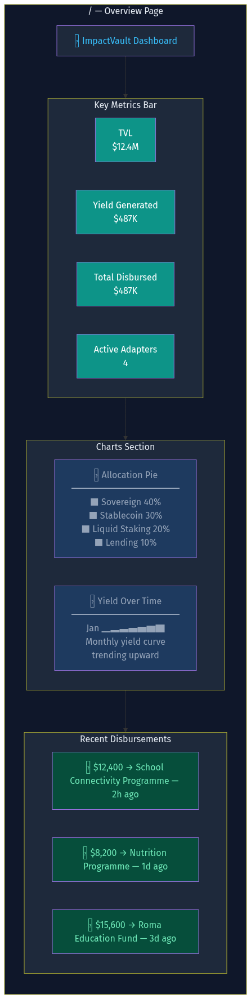
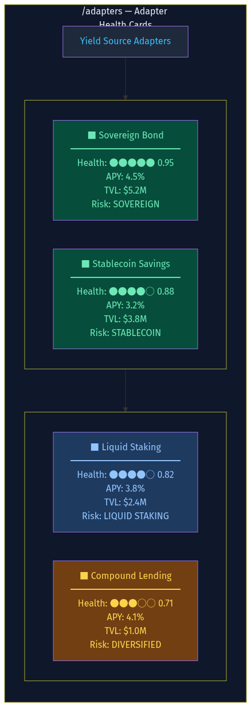
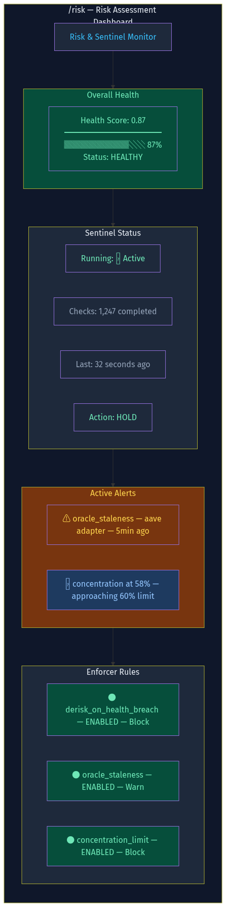
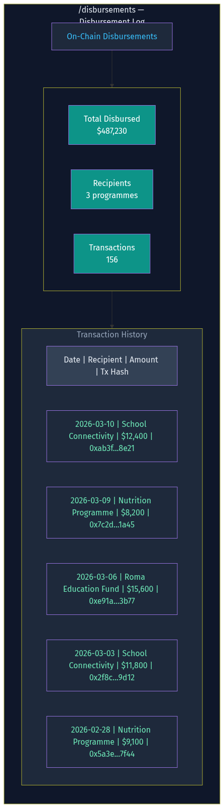

# ImpactVault M4-18 Design

**Date:** 2026-03-10
**Status:** Approved
**Scope:** Months 4-18 technical deliverables

## Decisions

- **Dashboard:** Next.js + Tailwind + shadcn/ui + recharts
- **Governance:** Simple multisig (N-of-M signers), Governor contract deferred
- **Mainnet L2:** Base (chain ID 8453)
- **New adapters:** Liquid staking (Lido wstETH), Diversified lending (Compound V3)

---

## 1. New Adapters

### Liquid Staking Adapter (`src/domain/adapters/liquid_staking.rs`)

Wraps Lido wstETH on Base.

- `deposit`: wrap ETH → stETH → wstETH via Lido router
- `withdraw`: unwrap wstETH → stETH → ETH
- `health_check`: monitors stETH/ETH peg deviation, withdrawal queue length, validator set size
- `current_yield_apy`: reads Lido APR from on-chain oracle (~3-4% from PoS rewards)
- `tvl`: reads wstETH balance

### Diversified Lending Adapter (`src/domain/adapters/compound_lending.rs`)

Wraps Compound V3 (Comet) on Base.

- `deposit`: supply USDC to Compound Comet
- `withdraw`: withdraw USDC from Comet
- `health_check`: monitors utilisation rate, oracle freshness, available liquidity, collateral coverage
- `current_yield_apy`: reads supply APR from Comet contract (~2-5%)
- `tvl`: reads supplied balance

---

## 2. Engine Upgrades

### Extended Risk Spectrum

```rust
pub enum RiskSpectrum {
    Sovereign,           // tokenised gov bonds
    StablecoinSavings,   // Aave lending
    LiquidStaking,       // Lido wstETH
    DiversifiedLending,  // Compound V3
    MultiStrategy,       // blended (M12-18)
}
```

### Multi-Strategy Allocation

- Safety-weighted distribution: safer sources (lower ordinal) get proportionally more capital
- Configurable weights per source in `VaultConfig`:
  ```rust
  pub source_weights: HashMap<RiskSpectrum, u8>,  // percentage weights
  ```
- Rebalancing trigger: when any allocation drifts > threshold from target weight, recommend rebalance
- `recommend_allocation` updated to use weights when multiple sources approved

### Adapter Name Mapping

`adapter_name_for()` extended:
- `LiquidStaking` → `"liquid_staking"`
- `DiversifiedLending` → `"compound_lending"`
- `MultiStrategy` → `"multi_strategy"`

---

## 3. Smart Contracts

### ImpactMultisig (`contracts/src/ImpactMultisig.sol`)

N-of-M signer governance for vault parameter changes.

- `signers` array + `threshold` (e.g., 2-of-3)
- `proposeAction(bytes calldata)` — any signer proposes
- `approveAction(uint256 proposalId)` — signers approve
- `executeAction(uint256 proposalId)` — executes when threshold met + timelock passed
- `TIMELOCK_DURATION = 2 days`
- Emergency bypass: any single signer can call `emergencyDerisk()` (reduces risk only)
- Events: ActionProposed, ActionApproved, ActionExecuted, EmergencyDeriskTriggered

### Deployment Scripts

- `contracts/script/DeployBase.s.sol` — deploys full stack to Base mainnet
  - Deploys ImpactVault with real asset (USDC on Base)
  - Deploys YieldSplitter with initial recipients
  - Deploys ImpactMultisig with initial signers
  - Transfers ownership to multisig
- `contracts/script/DeploySepolia.s.sol` — testnet deployment (already have mocks)
- Basescan verification via `forge verify-contract`

---

## 4. Dashboard (`dashboard/`)

Next.js app consuming the ImpactVault REST API.

### Pages

**Overview (`/`)**


- Key metrics bar: TVL, total yield generated, total disbursed, active adapters
- Allocation pie chart (risk spectrum breakdown)
- Yield over time line chart (monthly)
- Recent disbursements feed

**Adapters (`/adapters`)**


- Card per adapter: name, health score (colour-coded), APY, TVL, risk position
- Health indicators: green (>0.8), amber (0.5-0.8), red (<0.5)

**Risk (`/risk`)**


- Overall health gauge
- Sentinel status: running, checks completed, last check time, current action
- Active alerts/breaches
- Enforcer rules list with enable/disable status

**Disbursements (`/disbursements`)**


- Summary totals: total disbursed, recipient count, tx count
- Sortable table: date, recipient, amount, tx hash (links to block explorer)
- Filter by recipient, date range

### Tech Stack

```
dashboard/
├── package.json
├── next.config.js
├── tailwind.config.js
├── src/
│   ├── app/
│   │   ├── layout.tsx          (dark theme, nav sidebar)
│   │   ├── page.tsx            (overview)
│   │   ├── adapters/page.tsx
│   │   ├── risk/page.tsx
│   │   └── disbursements/page.tsx
│   ├── components/
│   │   ├── MetricCard.tsx
│   │   ├── HealthGauge.tsx
│   │   ├── AllocationPie.tsx
│   │   ├── YieldChart.tsx
│   │   ├── AdapterCard.tsx
│   │   ├── DisbursementTable.tsx
│   │   └── SentinelStatus.tsx
│   └── lib/
│       └── api.ts              (fetch wrapper for REST API)
```

### Data Flow

Dashboard → REST API (`http://localhost:3000`) → Engine/Sentinel/State

Polling interval: 30 seconds for live data. SSR for initial page load.

---

## 5. DPGA Registry Integration

New module `src/domain/dpga.rs`:

- `fetch_dpgs()` — HTTP GET to DPGA API, returns list of registered DPGs
- `DpgEntry` struct: name, description, website, repositories, stage
- `suggest_recipients(dpgs: &[DpgEntry])` — filters DPGs with active repos and known wallet addresses
- MCP tool: `dpga_list` — lists available DPGs for yield recipient configuration
- Config: `[dpga] api_url = "https://api.digitalpublicgoods.net/dpgs"`

---

## 6. REST API Expansion

Upgrade placeholder API to serve real data:

- `GET /vault/{id}/status` — real portfolio from SQLite
- `GET /vault/{id}/risk` — live risk assessment from engine
- `GET /adapters` — real adapter list with health from sentinel
- `GET /adapters/{name}/health` — individual adapter health
- `GET /sentinel/status` — live sentinel status
- `GET /yield/history` — yield events from SQLite
- `GET /disbursements` — disbursement log from SQLite
- `GET /risk/assessment` — full risk evaluation
- `POST /vault/{id}/deposit` — generate unsigned tx
- `POST /vault/{id}/withdraw` — generate unsigned tx

---

## 7. Config Updates

```toml
# New adapter configs
[[adapters]]
name = "liquid_staking"
type = "liquid_staking"
wsteth_address = "0x..."
chain_id = 8453
rpc_url = "https://mainnet.base.org"

[[adapters]]
name = "compound_lending"
type = "compound_lending"
comet_address = "0x..."
asset_address = "0x..."
chain_id = 8453
rpc_url = "https://mainnet.base.org"

# Governance
[governance]
type = "multisig"
contract_address = "0x..."
threshold = 2
signers = ["0x...", "0x...", "0x..."]

# DPGA
[dpga]
api_url = "https://api.digitalpublicgoods.net/dpgs"
enabled = true

# Dashboard
[dashboard]
api_url = "http://localhost:3000"
```

---

## Out of Scope

- Smart contract audit (external firm)
- MiCA/Romanian regulatory due diligence (legal counsel)
- Real RWA provider onboarding (business development)
- NGO partnership formation (human relationships)
- Governance token design (deferred)
